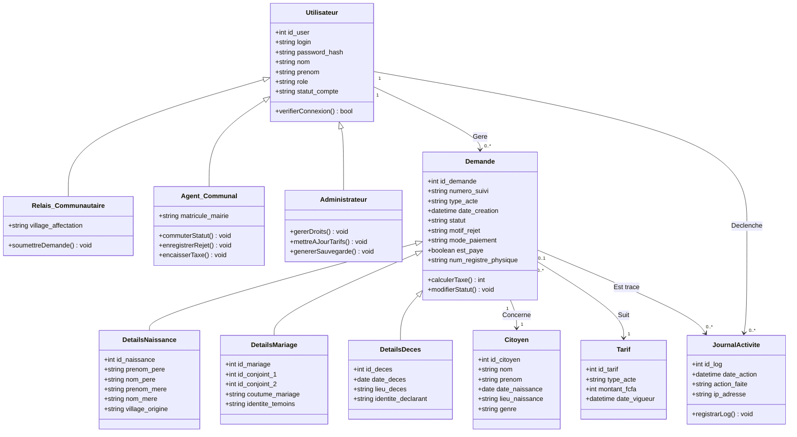

. 
# 📊 Modélisation UML Officielle : Civic-Tech Niaguis

Ce document regroupe les diagrammes UML mis à jour pour le projet **Civic-Tech Niaguis**. L'architecture intègre la gestion du **multi-actes** (Naissances, Mariages, Décès), l'aiguillage automatique sécurisé des rôles et le module de **facturation physique au guichet** de la mairie (NF-01).

---

## 👥 1. Diagramme de Cas d'Utilisation (Use Case)
*Ce diagramme définit la frontière de l'application Intranet et le cloisonnement strict des privilèges entre les acteurs (F-01).*

```mermaid
graph TD
    classDef acteur fill:#f9f,stroke:#333,stroke-width:2px;
    classDef systeme fill:#fff,stroke:#333,stroke-width:2px;
    classDef cas fill:#bbf,stroke:#333,stroke-width:1px;

    subgraph Acteurs du Système
        R[Intermédiaire / Relais]:::acteur
        A[Agent d'État Civil]:::acteur
        Admin[Administrateur Système]:::acteur
    end

    subgraph Application Civic-Tech Niaguis INTRANET LOCAL
        UC_Login(F-01: S'authentifier sur l'index)::cas
        UC_Routage(F-01: Aiguillage automatique par rôle)::cas
        
        subgraph Portail Relais Communautaire
            UC_Saisie(F-02: Saisir une pré-demande multi-actes)::cas
            UC_Tarif(F-02: Calculer et afficher automatiquement le tarif)::cas
            UC_Suivi_R(F-03: Suivre le tableau de bord des dossiers)::cas
            UC_Alerte(F-04: Recevoir une alerte de dossier rejeté)::cas
        end

        subgraph Portail Agent Communal
            UC_File(F-05: Consulter la file d'attente triée par village/acte)::cas
            UC_Statut(F-06: Commuter le statut du dossier)::cas
            UC_Rejet(F-07: Rejeter la demande avec motif obligatoire)::cas
            UC_PDF(F-08: Générer l'aperçu PDF de contrôle)::cas
            UC_Caisse(F-09: Encaisser la taxe au guichet de caisse)::cas
            UC_Facture(F-09: Générer et imprimer le reçu/facture PDF)::cas
            UC_Index(F-10: Clôturer par indexation au registre physique)::cas
        end

        subgraph Portail Administrateur
            UC_Droits(F-11: Gérer les comptes et les droits d'accès)::cas
            UC_ModifTarif(F-11: Configurer la grille tarifaire de la mairie)::cas
            UC_Backup(F-12: Exporter une sauvegarde MySQL à chaud)::cas
        end

        UC_Login -.-> |include| UC_Routage
        UC_Saisie -.-> |include| UC_Tarif
        UC_Statut -.-> |include| UC_PDF
        UC_Caisse -.-> |include| UC_Facture
        UC_Caisse -.-> |include| UC_Index
        UC_Statut -.-> |extend si dossier invalide| UC_Rejet
    end

    R --> UC_Login
    R --> UC_Saisie
    R --> UC_Suivi_R
    R --> UC_Alerte

    A --> UC_Login
    A --> UC_File
    A --> UC_Statut
    A --> UC_Caisse

    Admin --> UC_Login
    Admin --> UC_Droits
    Admin --> UC_ModifTarif
    Admin --> UC_Backup
```

---

## 🗂️ 2. Diagramme de Classes (Données Statiques)
*Ce diagramme modélise l'architecture des classes PHP et des tables MySQL en appliquant le pattern d'héritage/spécialisation pour éliminer les valeurs NULL.*



---

## ⏱️ 3. Diagramme de Séquence (Flux Chronologique)
*Ce diagramme détaille les requêtes asynchrones AJAX locales pour les tarifs (Étapes 6 à 8) et la sécurisation indissociable du traitement de caisse à la mairie.*

```mermaid
sequenceDiagram
    autonumber
    actor R as 👤 Relais Communautaire
    actor A as 🏢 Agent d'État Civil
    participant Sys as 💻 Système (PHP/JS)
    participant BDD as 🗄️ Base de Données (MySQL)

    Note over R, BDD: PHASE 1 : AUTHENTIFICATION & ROUTAGE PAR RÔLE
    R->+Sys: Saisir login / password_hash (index.php)
    Sys->+BDD: SELECT role, statut FROM Utilisateur WHERE login = :login
    BDD-->>-Sys: Retourne (role: 'relais', statut: 'actif')
    Sys->Sys: Initialiser \$_SESSION['role'] = 'relais'
    Sys-->>-R: Redirection automatique (portail_relais.php)

    Note over R, BDD: PHASE 2 : SAISIE MULTI-ACTES & REÇU CITOYEN
    R->+Sys: Sélectionner type d'acte (Ex: 'Naissance')
    Sys->+BDD: SELECT montant_fcfa FROM Tarif WHERE type_acte = 'Naissance'
    BDD-->>-Sys: Retourne 1000 FCFA
    Sys-->>R: Affichage JavaScript dynamique du prix à l'écran (1000 FCFA)
    R->Sys: Renseigner les champs du formulaire et valider
    Sys->+BDD: INSERT INTO Demande + DetailsNaissance (statut='Reçu', est_paye=0)
    BDD-->>-Sys: Confirmation insertion SQL
    Sys-->>-R: Génération et impression du reçu de suivi physique
    Note over R: Le Relais remet le reçu au Citoyen.<br/>Le Citoyen sait qu'il doit préparer 1000 FCFA.

    Note over A, BDD: PHASE 3 : INSTRUCTION, CAISSE ET CLÔTURE À LA MAIRIE
    A->+Sys: S'authentifier (role: 'agent') -> Accès portail_mairie.php
    Sys->+BDD: SELECT * FROM Demande WHERE statut = 'Reçu' ORDER BY date_creation
    BDD-->>-Sys: Retourne la file d'attente triée par village
    A->Sys: Cliquer sur le dossier et vérifier les pièces physiques du citoyen
    
    alt Dossier conforme : Passage au guichet de caisse
        A->Sys: Cliquer sur "Encaisser la taxe municipale"
        Sys->+BDD: UPDATE Demande SET est_paye = 1 WHERE id_demande = :id
        BDD-->>-Sys: Confirmation SQL
        Sys->Sys: Déclencher bibliothèque locale (FPDF/DomPDF)
        Sys-->>A: Génération et impression immédiate du reçu/facture PDF de caisse
        A->Sys: Saisir le numéro de registre physique annuel (Indexation)
        Sys->+BDD: UPDATE Demande SET statut = 'Signé & Archivé', num_registre = :num
        BDD-->>-Sys: Confirmation SQL
        Sys->+BDD: INSERT INTO JournalActivite (action='Encaissement + Clôture', id_user, ip)
        BDD-->>-Sys: Log d'audit comptable sécurisé (NF-03)
        Sys-->>A: Affichage "Dossier clôturé avec succès"
    else Dossier non conforme / invalide
        A->Sys: Saisir textuellement la cause juridique du refus
        Sys->+BDD: UPDATE Demande SET statut = 'Rejeté', motif_rejet = :motif
        BDD-->>-Sys: Confirmation SQL
        Sys-->>A: Dossier renvoyé au relais terrain
    end
    -A
```
