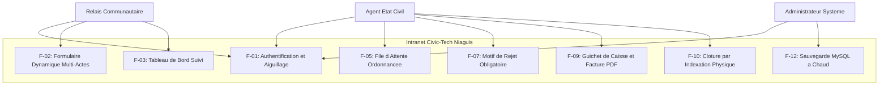
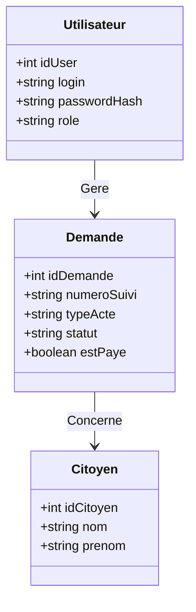
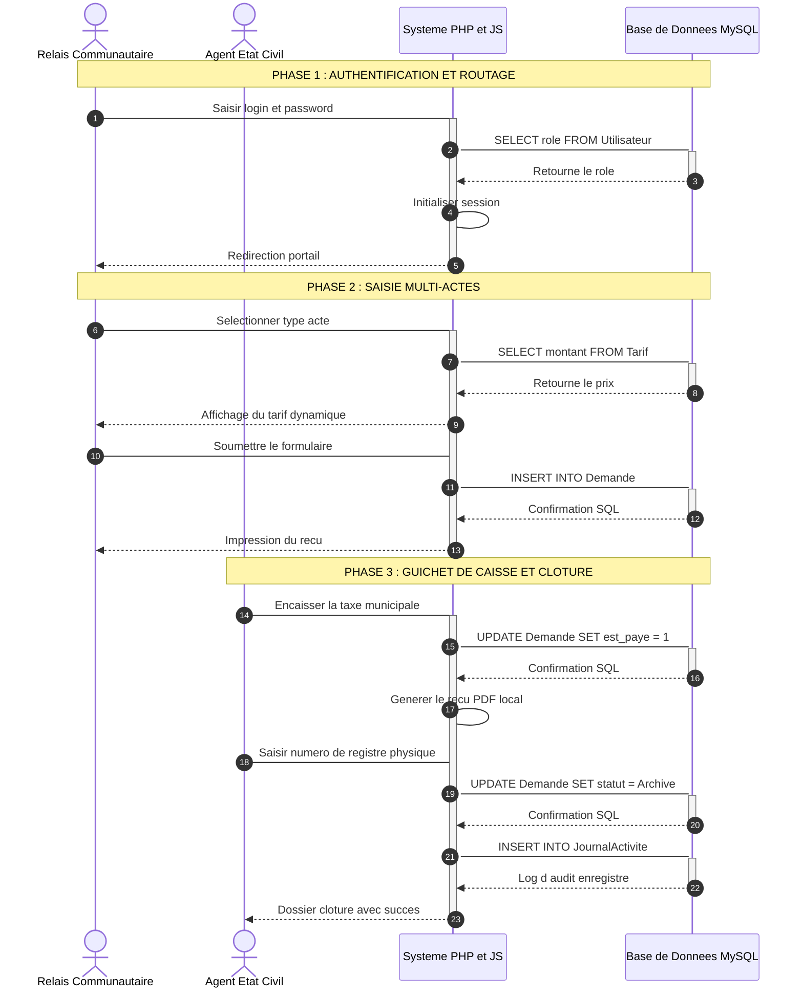

. 
# 📊 Modélisation UML Officielle : Civic-Tech Niaguis

Ce document regroupe les diagrammes UML mis à jour pour le projet **Civic-Tech Niaguis**.

---

## 👥 1. Diagramme de Cas d'Utilisation (Use Case)

---

## 🗂️ 2. Diagramme de Classes (Données Statiques)

---

## ⏱️ 3. Diagramme de Séquence (Flux Chronologique)

